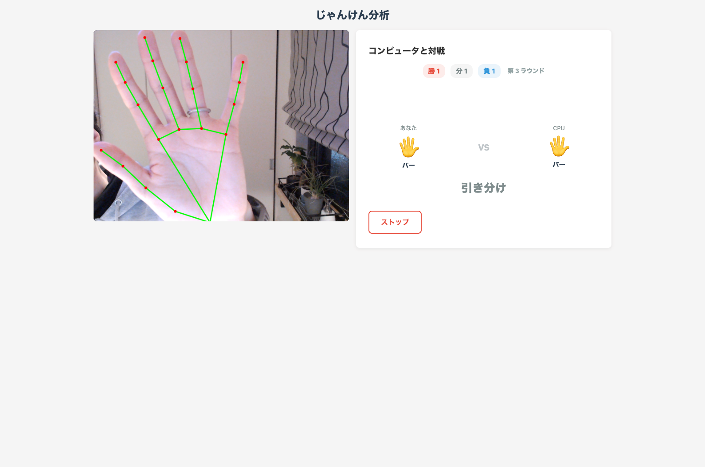
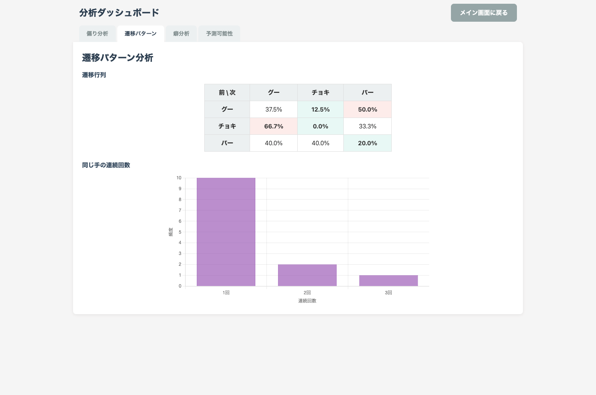
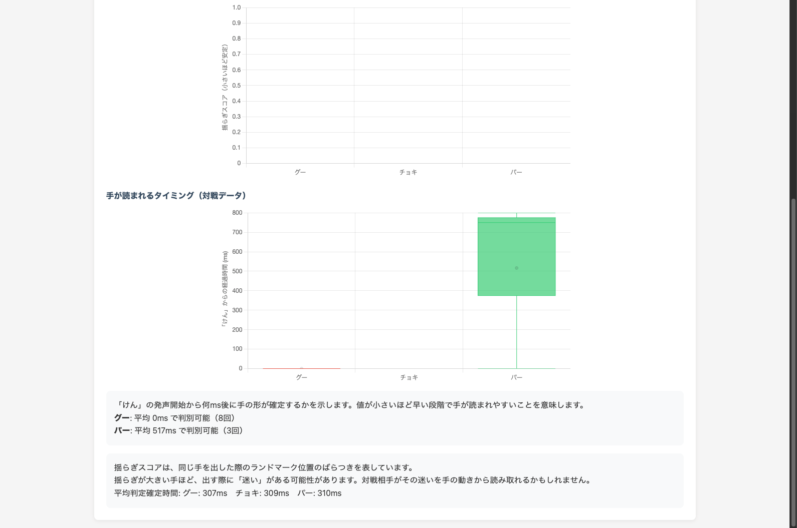
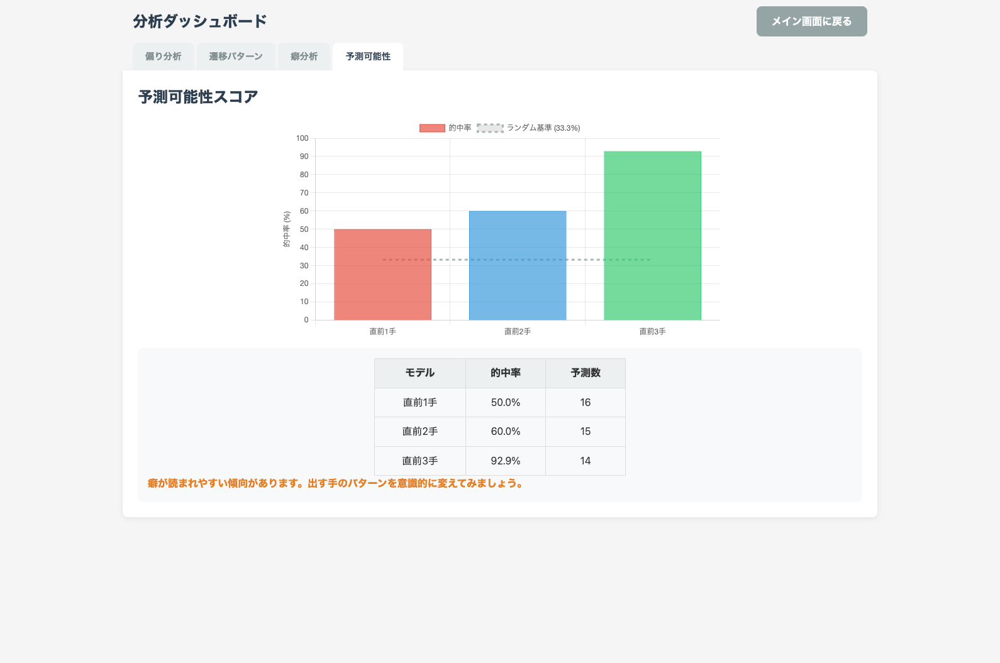

# じゃんけん分析トレーナー

カメラでリアルタイムにじゃんけんの手を認識し、コンピュータとの対戦を通じて自分の癖を分析するブラウザアプリです。

## 機能

### コンピュータとの対戦

「コンピュータと対戦」ボタンを押すと、音声で「じゃん・けん・ぽん」が自動再生され、連続対戦が始まります。コンピュータは過去の手のパターンを学習しながら対抗手を選ぶ適応型AIです。「ストップ」を押すと対戦が終了し、分析ダッシュボードに遷移します。



### 分析ダッシュボード

対戦後に4つの観点から手の癖を分析します。

| タブ | 内容 |
| - | - |
| 偏り分析 | グー/チョキ/パーの出現比率とカイ二乗検定によるp値 |
| 遷移パターン | 前の手から次の手への遷移確率行列と連続出し分布 |
| 癖分析 | 判定確定時間の箱ひげ図・手の揺らぎ比較・手が読まれるタイミング |
| 予測可能性 | 直前1〜3手の履歴から次の手を予測した的中率 |

「手が読まれるタイミング」では、「けん」の発声開始から何ms後に手の形が判別できるようになるかを手の種類別に表示します。値が小さいほど早バレしやすい手です。




### MLモデルの学習

「学習する」ボタンから自分の手でMLPモデルをブラウザ内で学習できます。学習済みモデルはIndexedDBに保存され、次回起動時から自動的に使用されます（未学習時はルールベース認識）。

## 動作環境

- HTTPS環境（または `localhost`）のモダンブラウザ
- カメラアクセスの許可が必要

## 開発

```bash
npm install
npm run dev    # 開発サーバー起動
npm run build  # プロダクションビルド
```
